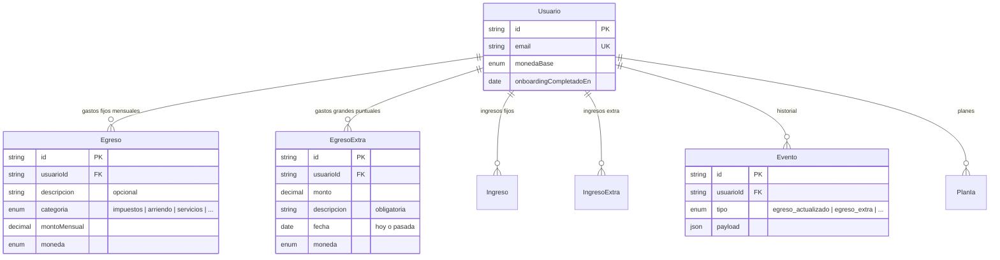
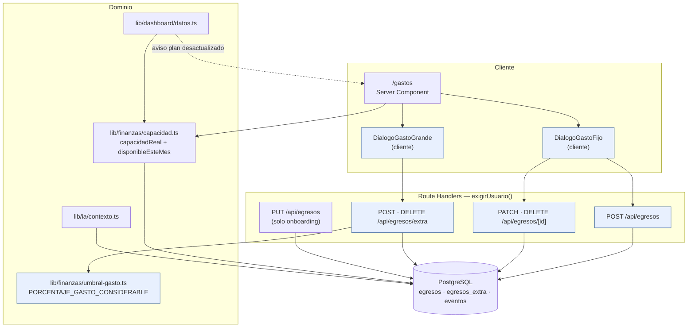
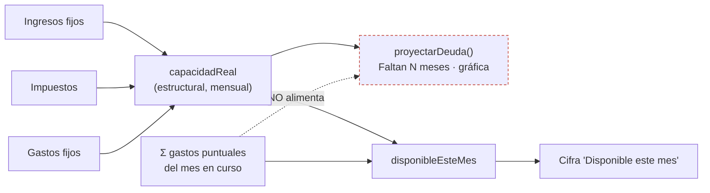
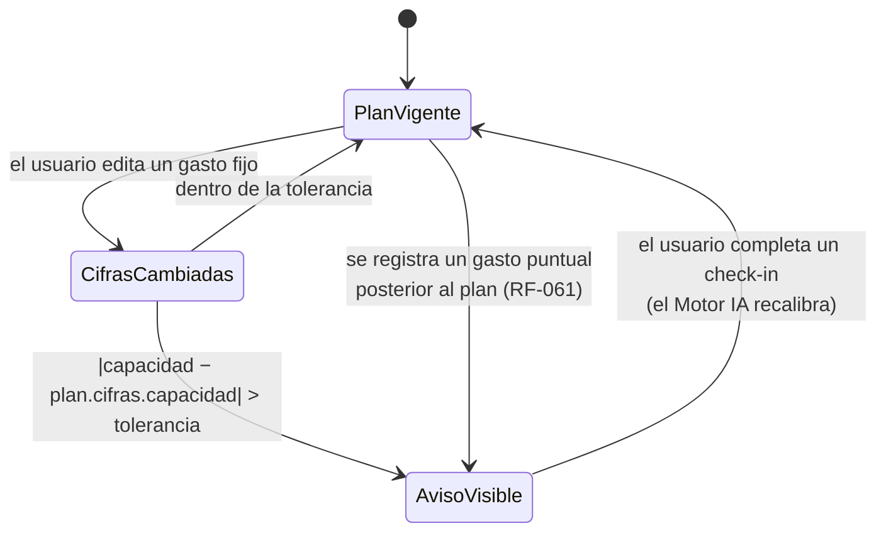

# Especificación Técnica — Gastos editables y gasto puntual considerable

> **Alcance.** Este documento especifica **una feature** del Coach Financiero, no
> un producto nuevo. Las secciones de contexto de negocio, roles, seguridad
> transversal, arquitectura general e infraestructura **se heredan sin cambios**
> de `docs/ESPECIFICACION_TECNICA.md`; aquí solo se documenta lo que esta
> feature añade o modifica.
>
> **Numeración.** Continúa la de la ETR: requerimientos funcionales desde
> **RF-039** y no funcionales desde **RNF-015**. Ningún RF existente se elimina;
> los que se ven afectados se citan explícitamente en §17.

---

## 1. Resumen Ejecutivo

Hoy los gastos fijos del usuario se capturan **una sola vez**, en el paso 4 del
onboarding, y no hay ninguna pantalla para volver a tocarlos. El endpoint que
los guarda (`PUT /api/egresos`) borra la lista entera y la reescribe, así que ni
siquiera existe la operación "editar un gasto". Un gasto mal anotado —o uno que
apareció después— queda mal para siempre, y como la fórmula central del producto
es `Ingresos − Egresos = capacidad real`, ese error contamina las tres cifras del
dashboard, la proyección de deuda y todos los planes que la IA genere de ahí en
adelante.

Esta feature cierra ese hueco con dos piezas que viven en una **pestaña nueva
`/gastos`**, construida con la misma forma que ya tiene `/ingresos`:

1. **Gastos fijos — CRUD.** Alta, edición y baja individual de los gastos
   mensuales recurrentes. Es la contraparte que faltaba del onboarding.
2. **Gasto puntual considerable.** Un gasto grande que ocurre una vez —la
   matrícula, la reparación del carro, el impuesto anual— y **no se repite**.
   Modelo propio (`EgresoExtra`), espejo de `IngresoExtra`.

La decisión de diseño que sostiene todo lo demás: **el gasto puntual descuenta
del mes en curso, pero no de la capacidad estructural**. Son dos números con
significados distintos y mezclarlos rompería la proyección de deuda —una
matrícula de un año empujaría el "Faltan N meses" como si se pagara todos los
meses—.

**Restricción de producto, no adorno:** la app no es un control de gastos y esta
feature no puede convertirla en uno. Se hace cumplir con dos mecanismos
verificables (RF-047, RF-048), no con buenas intenciones.

**Lo que esta feature NO hace:** no dispara el Motor IA. RF-034 fija tres
disparadores y esta feature no añade un cuarto.

---

## 2. Contexto y Objetivos de Negocio

### 2.1 Problema

| # | Problema observado | Consecuencia |
|---|---|---|
| P1 | Los gastos fijos solo se capturan en el onboarding | Un error de dedo queda permanente y desvía la capacidad real |
| P2 | La vida cambia: sube el arriendo, se acaba una colegiatura | Los datos envejecen sin forma de corregirlos |
| P3 | Un gasto grande e irrepetible no tiene dónde anotarse | La persona ve "Disponible este mes: $1.700.000" el mes que pagó $4.000.000 de matrícula. La cifra miente y erosiona la confianza en el plan |
| P4 | La asimetría con el ingreso | El ingreso extra sí tiene su sitio desde el Sprint 4; el gasto extra no |

### 2.2 Objetivos

- **O1.** Que la capacidad real refleje la realidad de hoy y no la del día del
  onboarding.
- **O2.** Que un gasto grande no haga mentir a la cifra del mes.
- **O3.** Que corregir los datos base no cueste rehacer el onboarding.
- **O4.** Que nada de lo anterior empuje al usuario hacia el registro diario de
  gastos.

### 2.3 Métricas de éxito

Con 11 usuarios como máximo, las métricas son observables sobre la tabla
`eventos`, no sobre un panel de analítica:

| Métrica | Objetivo | Cómo se mide |
|---|---|---|
| M1 — Adopción de la corrección | ≥ 50% de los usuarios activos edita al menos un gasto fijo en sus primeros 60 días | Eventos `egreso_actualizado` distintos por usuario |
| M2 — Uso previsto del gasto puntual | Mediana ≤ 2 gastos puntuales por usuario y mes | Conteo sobre `egresos_extra` agrupado por mes |
| M3 — Anti-deriva (la que importa) | Ningún usuario supera 4 gastos puntuales en un mes de forma sostenida | Misma consulta que M2, mirando el máximo |
| M4 — Salud del dato | El aviso de "plan desactualizado" aparece tras editar gastos, no días después | Verificación manual en QA |

**M3 es la métrica de fracaso.** Si se dispara, la feature está derivando hacia
un control de gastos y hay que endurecer RF-047, no celebrar el uso.

### 2.4 Alcance

**Dentro:** pestaña `/gastos`, CRUD de gastos fijos, registro y baja de gastos
puntuales, umbral mínimo, cifra "Disponible este mes" corregida, entrada de los
gastos puntuales al contexto de la IA, aviso de plan desactualizado.

**Fuera (explícitamente):** categorización de gastos puntuales, gastos previstos
o con fecha futura, presupuestos por categoría, gráficas de gasto por categoría
—prohibidas por `docs/DIRECTRICES_DISENO.md` §6—, importación de extractos
bancarios, recordatorios de gastos, y cualquier cuarto disparador del Motor IA.

---

## 3. Glosario

| Término | Definición |
|---|---|
| **Gasto fijo** | Egreso mensual recurrente. En la base es `Egreso` y tiene `CategoriaEgreso`. En la interfaz siempre se llama "gasto fijo", nunca "egreso". |
| **Gasto puntual considerable** | Egreso grande que ocurre una vez y no se repite. En la base es `EgresoExtra`. En la interfaz, "gasto grande". |
| **Capacidad real (estructural)** | `Ingresos − Impuestos − Gastos fijos`. El margen **mensual recurrente**. Es lo que alimenta `proyectarDeuda()` y el plan. No la tocan los gastos puntuales. Campo `capacidadReal` de `lib/finanzas/capacidad.ts`. |
| **Disponible este mes** | `capacidadReal − Σ gastos puntuales del mes en curso`. Lo que de verdad queda **este mes**. Es la cifra que se pinta en el dashboard bajo esa etiqueta. Campo nuevo `disponibleEsteMes`. |
| **Mes en curso** | Mes calendario en zona `America/Bogota`, del día 1 a las 00:00 al último día a las 23:59:59. |
| **Umbral de considerable** | Monto mínimo por debajo del cual la app rechaza registrar un gasto puntual (RF-047). |

---

## 4. Actores y Roles

Sin cambios respecto de la ETR. Solo interviene el rol **usuario**.

El **administrador no ve nada de esto** (RNF-006): los gastos son datos
financieros y el panel de admin no los consulta ni los consultará.

---

## 5. Requerimientos Funcionales

### 5.1 Navegación y pantalla

| ID | Requerimiento | Prioridad |
|---|---|---|
| RF-039 | La barra de navegación principal incluye un sexto enlace, **"Gastos"**, hacia `/gastos`, visible en escritorio y dentro del menú de hamburguesa en móvil | Must |
| RF-040 | La pantalla `/gastos` muestra dos secciones: **"Gastos fijos"** (lista con descripción, categoría, monto y total mensual) y **"Gastos grandes"** (lista de los gastos puntuales recientes) | Must |
| RF-041 | Si el usuario no tiene gastos fijos registrados, la sección muestra un estado vacío que explica la consecuencia: sin gastos no se puede calcular cuánto le queda al mes | Must |

### 5.2 CRUD de gastos fijos

| ID | Requerimiento | Prioridad |
|---|---|---|
| RF-042 | El usuario puede **agregar** un gasto fijo indicando categoría (obligatoria), monto mensual (obligatorio, > 0) y descripción (opcional) | Must |
| RF-043 | El usuario puede **editar** cualquier gasto fijo propio: descripción, categoría y monto | Must |
| RF-044 | El usuario puede **eliminar** un gasto fijo propio. La baja es inmediata y definitiva; no hay papelera | Must |
| RF-045 | Toda alta, edición o baja de un gasto fijo escribe un evento de tipo `egreso_actualizado` con el `egresoId`, la acción (`alta`/`edicion`/`baja`) y el monto | Must |
| RF-046 | Al guardar cualquier cambio en los gastos fijos, la capacidad real y las tres cifras del dashboard se recalculan en la siguiente carga, sin acción adicional del usuario | Must |

### 5.3 Gasto puntual considerable

| ID | Requerimiento | Prioridad |
|---|---|---|
| RF-047 | El usuario puede registrar un gasto puntual indicando **monto** (obligatorio), **descripción** (obligatoria) y **fecha** (obligatoria, hoy o pasada; nunca futura) | Must |
| RF-048 | El sistema **rechaza** un gasto puntual cuyo monto sea inferior al **5% de sus ingresos fijos mensuales**, con un mensaje que explica que esta pantalla es para gastos grandes, no para el día a día. Si el usuario no tiene ingresos registrados, el umbral no aplica | Must |
| RF-049 | El formulario de gasto puntual **no ofrece categorías** y su texto de ayuda nombra ejemplos de gasto grande e irrepetible (matrícula, reparación, impuesto anual, viaje). La pantalla no muestra contadores, rachas ni ningún refuerzo por registrar más gastos | Must |
| RF-050 | Un gasto puntual **no modifica la lista de gastos fijos** ni la capacidad real estructural | Must |
| RF-051 | El usuario puede **eliminar** un gasto puntual propio (registro equivocado). No se puede editar: se elimina y se vuelve a registrar | Should |
| RF-052 | La sección "Gastos grandes" lista los **12 más recientes**, ordenados por fecha descendente, con descripción, fecha y monto | Must |
| RF-053 | Registrar un gasto puntual con el onboarding sin completar responde `409` y no persiste nada | Must |

### 5.4 Efecto sobre las cifras

| ID | Requerimiento | Prioridad |
|---|---|---|
| RF-054 | La cifra **"Disponible este mes"** del dashboard es `capacidad real − suma de los gastos puntuales del mes en curso`. Cuando hay alguno, su línea de contexto lo dice explícitamente: *"después de impuestos, gastos fijos y $X de gastos grandes de este mes"* | Must |
| RF-055 | La **proyección de deuda** (`proyectarDeuda()`), el "Faltan N meses" y la gráfica siguen usando la **capacidad estructural**, nunca el disponible del mes | Must |
| RF-056 | "Disponible este mes" puede quedar **negativo** y se muestra tal cual, sin recortarse a cero, coherente con la regla existente de la capacidad real | Must |
| RF-057 | El dashboard sigue mostrando **exactamente tres cifras**. Esta feature no añade una cuarta: reutiliza la que ya se llama "Disponible este mes" | Must |
| RF-058 | La pantalla `/gastos` muestra el total de gastos puntuales del mes en curso junto a la sección "Gastos grandes" | Should |

### 5.5 Relación con el Motor IA

| ID | Requerimiento | Prioridad |
|---|---|---|
| RF-059 | Ni el CRUD de gastos fijos ni el registro de un gasto puntual **disparan el Motor IA**. RF-034 sigue fijando tres disparadores: onboarding, check-in e ingreso extraordinario | Must |
| RF-060 | Los gastos puntuales de los **últimos 30 días** entran en el contexto estructurado que recibe el Motor IA (`construirContexto`), para que el próximo plan —el del check-in— los tenga en cuenta | Must |
| RF-061 | El aviso de **"plan desactualizado"** del dashboard se enciende también cuando existe al menos un gasto puntual registrado con fecha posterior a la generación del plan vigente, aunque la capacidad estructural no se haya movido | Must |

### 5.6 Onboarding

| ID | Requerimiento | Prioridad |
|---|---|---|
| RF-062 | El paso 4 del onboarding (RF-012) **no cambia**: sigue capturando los gastos fijos con la lista repetible y sigue siendo obligatorio para cerrar el registro | Must |
| RF-063 | `PUT /api/egresos` —que borra la lista completa y la reescribe— queda **reservado al onboarding**. La pantalla `/gastos` nunca lo llama; usa exclusivamente las operaciones individuales | Must |

---

## 6. Historias de Usuario y Criterios de Aceptación

### HU-01 — Corregir un gasto fijo mal anotado
> **Como** usuario **quiero** editar el monto de un gasto fijo **para** que la
> app deje de calcular mi capacidad con un número equivocado.

**Cubre:** RF-039, RF-040, RF-043, RF-045, RF-046 · **Prioridad:** Must

```gherkin
Dado que tengo un gasto fijo "Arriendo" de $1.200.000
Cuando abro la pestaña "Gastos", pulso "Editar" en esa fila y lo cambio a $1.500.000
Entonces la lista muestra $1.500.000 y el total mensual sube $300.000
Y al volver al dashboard "Disponible este mes" bajó $300.000
Y queda un evento `egreso_actualizado` con acción "edicion"
```

```gherkin
Dado que edito un gasto fijo y dejo el monto en 0 o en blanco
Cuando intento guardar
Entonces el formulario no envía nada y muestra un error junto al campo
```

### HU-02 — Agregar un gasto fijo que apareció después
> **Como** usuario **quiero** agregar un gasto mensual nuevo **para** no tener
> que rehacer mi registro cuando mi vida cambia.

**Cubre:** RF-042, RF-045, RF-046 · **Prioridad:** Must

```gherkin
Dado que estoy en la pestaña "Gastos"
Cuando agrego "Gimnasio", categoría "otro", $180.000
Entonces aparece en la lista de gastos fijos
Y el total mensual sube $180.000
Y el dashboard muestra el aviso de plan desactualizado si la desviación supera la tolerancia
```

### HU-03 — Eliminar un gasto fijo que ya no existe
> **Como** usuario **quiero** borrar un gasto que dejé de pagar **para** que no
> siga restándome capacidad.

**Cubre:** RF-044, RF-045 · **Prioridad:** Must

```gherkin
Dado que terminé de pagar una colegiatura de $600.000
Cuando la elimino desde la pestaña "Gastos" y confirmo
Entonces desaparece de la lista y el total baja $600.000
Y queda un evento `egreso_actualizado` con acción "baja"
```

```gherkin
Dado que elimino el último gasto fijo que me quedaba
Cuando recargo el dashboard
Entonces la capacidad real es igual a mis ingresos y ninguna pantalla falla
```

### HU-04 — Anotar un gasto grande del mes
> **Como** usuario **quiero** registrar la matrícula que acabo de pagar **para**
> que la app no me diga que tengo un dinero que ya gasté.

**Cubre:** RF-047, RF-050, RF-052, RF-054, RF-055, RF-058 · **Prioridad:** Must

```gherkin
Dado que mi capacidad real es $1.700.000
Cuando registro un gasto grande de $4.000.000, "Matrícula del semestre", con fecha de hoy
Entonces "Disponible este mes" muestra -$2.300.000
Y su línea de contexto menciona los $4.000.000 de gastos grandes de este mes
Y el "Faltan N meses" y la gráfica de proyección NO cambian
Y mi lista de gastos fijos sigue igual que antes
```

```gherkin
Dado que registré un gasto grande el mes pasado
Cuando entro al dashboard este mes
Entonces "Disponible este mes" vuelve a ser la capacidad real completa
```

```gherkin
Dado que intento poner una fecha del mes que viene
Cuando envío el formulario
Entonces se rechaza con "La fecha no puede ser futura" y no se guarda nada
```

### HU-05 — Que la app no me convierta en contador
> **Como** usuario **quiero** que la app siga siendo un coach y no un diario de
> gastos **para** no abandonarla en dos semanas.

**Cubre:** RF-048, RF-049 · **Prioridad:** Must

```gherkin
Dado que mis ingresos fijos suman $4.800.000 (umbral: $240.000)
Cuando intento registrar un gasto grande de $35.000 "Almuerzo"
Entonces se rechaza con un mensaje que explica que esta pantalla es para gastos
  grandes y que los del día a día van en los gastos fijos
Y no se guarda nada
```

```gherkin
Dado que abro el formulario de gasto grande
Entonces no veo ningún selector de categoría
Y el texto de ayuda nombra matrícula, reparación, impuesto o viaje como ejemplos
Y no hay ningún contador de "gastos registrados" ni racha
```

```gherkin
Dado que no tengo ningún ingreso fijo registrado
Cuando registro un gasto grande de cualquier monto
Entonces se acepta: sin ingresos no hay umbral que calcular
```

### HU-06 — Deshacer un registro equivocado
> **Como** usuario **quiero** borrar un gasto grande que anoté mal **para** que
> mi cifra del mes no quede rota hasta fin de mes.

**Cubre:** RF-051 · **Prioridad:** Should

```gherkin
Dado que registré $40.000.000 en vez de $4.000.000
Cuando elimino el registro y lo vuelvo a crear con el monto correcto
Entonces "Disponible este mes" refleja solo el monto correcto
```

### HU-07 — Que el plan sepa lo que pasó
> **Como** usuario **quiero** que mi próximo plan tenga en cuenta el gastón del
> mes **para** que sus consejos no ignoren lo que de verdad me pasó.

**Cubre:** RF-059, RF-060, RF-061 · **Prioridad:** Must

```gherkin
Dado que registro un gasto grande
Entonces NO se llama al Motor IA ni se genera un plan nuevo
Y el dashboard muestra el aviso de que el plan puede estar desactualizado
```

```gherkin
Dado que registré un gasto grande hace 10 días
Cuando completo un check-in
Entonces el contexto enviado al modelo incluye ese gasto
Y el plan resultante lo tiene disponible para su prosa
```

---

## 7. Requerimientos No Funcionales

| ID | Categoría | Requerimiento | Verificación |
|---|---|---|---|
| RNF-015 | **Seguridad** | El `usuarioId` de todos los endpoints nuevos sale **siempre de la sesión**, nunca del cuerpo ni de la URL. Un `id` de gasto ajeno responde **404**, no 403 | `scripts/idor-probar.mts` ampliado con los cuatro endpoints nuevos, con control positivo sobre recurso propio |
| RNF-016 | **Seguridad** | Sin cookie de sesión, todos los endpoints nuevos responden **401** | Mismo script |
| RNF-017 | **Privacidad** | Ningún dato de gastos aparece en el panel de administración ni en ningún `select` accesible al rol admin | Revisión de código de `app/(admin)/` |
| RNF-018 | **Rendimiento** | La pantalla `/gastos` carga en < 3 s. Todas sus consultas se lanzan **en paralelo** desde el Server Component, siguiendo el patrón de `/ingresos` | Medición manual; revisión de que no haya `await` en serie |
| RNF-019 | **Rendimiento** | El cálculo del disponible del mes **no añade una consulta por cifra**: se resuelve dentro del `Promise.all` existente de `lib/dashboard/datos.ts` | Revisión de código |
| RNF-020 | **Usabilidad** | La pantalla es funcional a 375px: la lista no produce scroll horizontal y los diálogos caben en pantalla | Navegador a 375px |
| RNF-021 | **Usabilidad** | Todo icono dentro de un `DialogTrigger asChild` nace en un componente cliente. Verificación obligatoria: cargar `/gastos` con JavaScript desactivado y contar los botones del HTML del servidor | Playwright con `javaScriptEnabled: false` |
| RNF-022 | **Mantenibilidad** | El porcentaje del umbral (RF-048) vive en **una sola constante exportada**, leída a la vez por la validación del servidor y por el texto de ayuda de la pantalla | Revisión de código: una sola definición |
| RNF-023 | **Mantenibilidad** | La migración de base de datos es **puramente aditiva**: una tabla nueva y un valor nuevo de enum. Ninguna columna se elimina ni se renombra | Revisión del SQL generado |
| RNF-024 | **Consistencia** | Los montos se guardan en la `monedaBase` del usuario, como todo lo demás. No hay conversión ni mezcla de monedas | Revisión de código |
| RNF-025 | **Observabilidad** | Los rechazos por umbral (RF-048) no se loguean con el monto: basta el hecho y el `usuarioId` | Revisión de código |

---

## 8. Modelo de Datos

### 8.1 Cambios

**Modelo nuevo `EgresoExtra`** (tabla `egresos_extra`), espejo exacto de
`IngresoExtra`. Sin categoría a propósito (RF-049): categorizar un gasto grande
invita a categorizar todos.

```prisma
/// Un gasto grande que ocurrió una vez y no se repite: la matrícula, la
/// reparación del carro, el impuesto anual.
///
/// Es un modelo aparte de `Egreso` y no una fila más con una bandera porque
/// significan cosas distintas: `Egreso` es un compromiso mensual y entra en
/// la capacidad real —la cifra que proyecta la deuda a años vista—, mientras
/// que esto ocurrió un día y solo afecta a su mes. Mezclarlos haría que una
/// matrícula empujara el "Faltan N meses" como si se pagara doce veces.
///
/// Sin categoría a propósito: la app no es un control de gastos y un selector
/// de categorías es la primera invitación a registrarlo todo.
model EgresoExtra {
  id          String   @id @default(uuid())
  usuarioId   String   @map("usuario_id")
  monto       Decimal  @db.Decimal(15, 2)
  moneda      Moneda   @default(COP)
  descripcion String

  /// El día en que ocurrió. Columna DATE: se escribe y se lee en UTC
  /// (`new Date("YYYY-MM-DDT00:00:00Z")` y `formatearFechaUtc`) o en Colombia
  /// el día se corre uno hacia atrás.
  fecha       DateTime @db.Date

  createdAt   DateTime @default(now()) @map("created_at")

  usuario Usuario @relation(fields: [usuarioId], references: [id], onDelete: Cascade)

  @@index([usuarioId, fecha])
  @@map("egresos_extra")
}
```

**Enum `TipoEvento`**: se añade el valor `egreso_extra`.

Añadir un valor a un enum de PostgreSQL es aditivo y no dispara el diálogo
interactivo de `prisma migrate dev` —lo que sí lo dispara es *eliminar* un
valor—. Aun así, el procedimiento seguro documentado en `CLAUDE.md` sigue
aplicando: generar el SQL con `migrate diff --from-config-datasource
--to-schema` y aplicarlo con `migrate deploy`.

Se añade valor nuevo en vez de reutilizar `egreso_actualizado` con un
discriminador en el payload porque el historial tendrá que distinguirlos: uno
cambió la estructura del mes, el otro fue un golpe de un día.

**`Usuario`**: se añade la relación inversa `egresosExtra EgresoExtra[]`.

**Nada más cambia.** `Egreso` se queda tal cual: el CRUD nuevo opera sobre el
modelo que ya existe.

### 8.2 Diagrama



### 8.3 Volumen y retención

Con 11 usuarios y un uso previsto de ≤ 2 gastos puntuales al mes (M2), la tabla
crece ~264 filas al año en el peor caso. **No se purga**: el historial es lo que
da sentido a releer un check-in viejo, y el volumen es irrelevante.

---

## 9. Arquitectura

Sin cambios estructurales. La feature se acopla a las tres capas que ya existen
y respeta sus reglas: el proxy no autoriza, el DAL sí, y el `usuarioId` sale de
la sesión.



### 9.1 Dónde vive cada decisión

| Decisión | Único sitio | Por qué ahí |
|---|---|---|
| Umbral de "considerable" | `lib/finanzas/umbral-gasto.ts` | Lo leen la validación del servidor y el texto de la pantalla. Duplicarlo daría un formulario que promete lo que la API rechaza —el mismo error que ya se evitó con el candado de 30 días de los objetivos— |
| Qué es el "mes en curso" | `lib/finanzas/capacidad.ts` | Una sola definición de los límites en `America/Bogota` |
| Cálculo del disponible | `calcularCapacidadReal()` | Ya devuelve el objeto `Capacidad`; se le añade `gastosPuntualesMes` y `disponibleEsteMes` |
| Qué lee la IA | `lib/ia/contexto.ts` | Es el único sitio donde se arma lo que el modelo llega a ver |

### 9.2 Ruta `/gastos` con modelo `Egreso` — deliberado

La URL y toda la interfaz dicen **"gastos"**; la base de datos y el código
interno dicen **"egreso"**. No es un descuido: "egreso" es el término contable
que usa la ETR y el schema, y "gasto" es la palabra que usa la gente
(`docs/DIRECTRICES_DISENO.md` §19 y el propio onboarding: *"Anota tus gastos
fijos"*). La URL es interfaz. Los endpoints se quedan bajo `/api/egresos` por
coherencia con el modelo.

---

## 10. API

Todos los endpoints exigen sesión (`exigirUsuario`), leen el `usuarioId` de
ella, y responden 401 sin cookie y 404 ante un id ajeno.

| Método y ruta | Cuerpo | Respuesta | Notas |
|---|---|---|---|
| `POST /api/egresos` | `{ descripcion?, categoria, monto }` | `201 { ok, id }` | Alta individual. Escribe evento `egreso_actualizado` con acción `alta` |
| `PATCH /api/egresos/[id]` | `{ descripcion?, categoria, monto }` | `200 { ok }` | Evento con acción `edicion`. 404 si el id no es del usuario |
| `DELETE /api/egresos/[id]` | — | `200 { ok }` | Evento con acción `baja`. 404 si el id no es del usuario |
| `PUT /api/egresos` | `{ egresos: [...] }` | `200 { ok, guardados }` | **Ya existe. No se modifica.** Reemplazo total, reservado al onboarding (RF-063) |
| `POST /api/egresos/extra` | `{ monto, descripcion, fecha }` | `201 { ok, id }` · `422` si no llega al umbral · `409` sin onboarding | Evento `egreso_extra`. **No llama al Motor IA** |
| `DELETE /api/egresos/extra/[id]` | — | `200 { ok }` | 404 si el id no es del usuario |

**Códigos elegidos:** `422` y no `400` para el umbral, porque el cuerpo está
bien formado y es la **regla de negocio** la que lo rechaza; el cliente necesita
distinguirlo para mostrar el mensaje explicativo en vez de "revisa los datos".

**Validación** con zod 4 en `lib/finanzas/esquemas.ts`, junto a los que ya
existen. `z.email()` es top-level y los enums llevan `{ error: "..." }` o
responden en inglés.

**Idempotencia y doble envío:** el botón se deshabilita mientras la petición
está en vuelo. No hace falta la ventana de 20 s que protege al Motor IA: aquí no
hay llamada cara y un duplicado se borra con RF-051.

---

## 11. Flujos

### 11.1 Registrar un gasto grande

```mermaid
sequenceDiagram
    actor U as Usuario
    participant P as /gastos
    participant API as POST /api/egresos/extra
    participant UMB as umbral-gasto.ts
    participant DB as PostgreSQL

    U->>P: Abre "Anotar un gasto grande"
    P-->>U: Formulario sin categorías, con ejemplos
    U->>API: { monto, descripcion, fecha }
    API->>API: exigirUsuario() → usuarioId de la sesión
    API->>API: onboarding completado? → si no, 409
    API->>API: zod: monto > 0, descripción no vacía, fecha ≤ hoy
    API->>DB: SUM(ingresos.montoMensual) del usuario
    API->>UMB: monto ≥ 5% de ingresos?
    alt Por debajo del umbral
        UMB-->>API: no
        API-->>U: 422 "Esta pantalla es para gastos grandes…"
    else Considerable (o sin ingresos registrados)
        UMB-->>API: sí
        API->>DB: BEGIN
        API->>DB: INSERT egresos_extra
        API->>DB: INSERT eventos (tipo egreso_extra)
        API->>DB: COMMIT
        API-->>P: 201 { ok, id }
        Note over API: NO se llama al Motor IA (RF-059)
        P->>P: router.refresh()
        P-->>U: Aparece en "Gastos grandes";<br/>el dashboard mostrará el disponible corregido
    end
```

### 11.2 Las dos cifras, y por qué son dos



La flecha punteada es el requerimiento: si los gastos puntuales llegaran a
`proyectarDeuda()`, un gasto de un día se proyectaría como si se repitiera cada
mes durante años.

### 11.3 Editar un gasto fijo y el aviso del plan



---

## 12. Plan de Pruebas

### 12.1 Unitarias

| Caso | Esperado |
|---|---|
| `calcularCapacidadReal` sin gastos puntuales | `disponibleEsteMes === capacidadReal` |
| Con un gasto puntual de este mes | `disponibleEsteMes === capacidadReal − monto` |
| Con un gasto puntual del mes pasado | `disponibleEsteMes === capacidadReal` |
| Gasto puntual el día 1 a las 00:00 hora Bogotá | Cuenta para el mes en curso (prueba de la frontera UTC−5) |
| Gasto puntual el último día del mes a las 23:59 Bogotá | Cuenta para el mes en curso |
| Capacidad $1.700.000, gasto puntual $4.000.000 | `disponibleEsteMes` negativo, no recortado a cero |
| Umbral con ingresos de $4.800.000 | Rechaza $239.999, acepta $240.000 |
| Umbral sin ingresos registrados | Acepta cualquier monto positivo |
| Esquema zod con fecha de mañana | Rechaza |

### 12.2 Integración (curl con sesión real, contra la base)

Siguiendo el método con el que se probaron los objetivos del Sprint 6:

1. `POST /api/egresos` → 201, la fila existe, el evento existe.
2. `PATCH` sobre id propio → 200, monto cambiado.
3. `PATCH` sobre uuid **de otro usuario real** → 404 (no 403, no 200).
4. `DELETE` sobre id propio → 200; repetir → 404.
5. `POST /api/egresos/extra` bajo umbral → 422, **nada persistido**.
6. `POST /api/egresos/extra` válido → 201, evento `egreso_extra`, **ningún
   `PlanIa` nuevo** (la verificación de RF-059).
7. `POST /api/egresos/extra` sin onboarding → 409.
8. Sin cookie, los seis endpoints → 401.

### 12.3 Seguridad (RNF-015)

Ampliar `scripts/idor-sembrar.mts` para que las dos cuentas tengan gastos fijos
y gastos puntuales, y `scripts/idor-probar.mts` con cuatro ataques nuevos:
`PATCH` y `DELETE` de `/api/egresos/[id]` y `DELETE` de
`/api/egresos/extra/[id]` contra recursos de B, más el control positivo sobre
los propios de A.

**El control positivo no es opcional.** Sin él, un cuerpo que zod rechaza daría
404 en todo y el script se leería como una app segura.

### 12.4 End-to-end en navegador

Con Playwright sobre Chrome (`chromium.launch({ channel: "chrome" })`), como en
el recorrido del Sprint 8:

1. Recorrido completo de HU-01 a HU-06 a 1280px y a 375px.
2. **Contexto con `javaScriptEnabled: false`** sobre `/gastos`: contar los
   botones del HTML del servidor. Si falta alguno, hay un icono de
   `lucide-react` creado en un Server Component dentro de un `DialogTrigger`
   (RNF-021).
3. Escuchar `pageerror` y `console` de tipo `error` en cada navegación.
4. Verificar que la barra de navegación con seis enlaces no produce scroll
   horizontal a 375px —el menú de hamburguesa ya cubre ese rango—.

### 12.5 Regresión obligatoria

- El **onboarding completo** sigue funcionando: `PUT /api/egresos` no se tocó,
  pero es el que más pierde si alguien lo "unifica" con el POST.
- El **check-in** completo, para comprobar que el contexto ampliado (RF-060) no
  rompe la generación del plan.
- `npx tsc --noEmit`, `npm run lint` y `npm run build` antes de commitear.

---

## 13. Riesgos y Mitigaciones

| # | Riesgo | Impacto | Mitigación |
|---|---|---|---|
| R1 | **Deriva a control de gastos.** La pestaña invita a anotarlo todo y la app pierde su propósito | Alto | RF-048 (umbral) y RF-049 (copy sin categorías). Métrica M3 vigilada. Si se dispara, se sube el umbral, no se relaja |
| R2 | **El umbral bloquea a alguien con razón.** Ingreso alto y un gasto que para esa persona sí es grande | Medio | El umbral es **relativo** al ingreso, no absoluto. El mensaje de rechazo explica y ofrece la salida: si se repite cada mes, va en los gastos fijos |
| R3 | **Alguien "simplifica" y suma los gastos puntuales a `capacidadReal`** | Alto | El comentario del modelo y RF-055 lo dicen. La prueba unitaria de la proyección con un gasto puntual de este mes es la red |
| R4 | **La pantalla llama a `PUT /api/egresos`** y borra todos los gastos del usuario | Crítico | RF-063 explícito y comentario en el handler. La prueba de HU-02 revisa que el resto de la lista sigue ahí después de un alta |
| R5 | **Icono en `DialogTrigger` desde un Server Component**: el botón desaparece del HTML | Alto | Es un fallo con historia: estuvo cuatro sprints vivo en cuatro pantallas. RNF-021 obliga a la comprobación sin JavaScript |
| R6 | **La columna `@db.Date` corre el día** en Colombia | Medio | `new Date("YYYY-MM-DDT00:00:00Z")` al escribir y `formatearFechaUtc` al leer. Pruebas de frontera en §12.1 |
| R7 | **Se cuela un cuarto disparador del Motor IA** por simetría con el ingreso extra | Medio | RF-059 y la prueba de integración nº 6, que verifica que no nace ningún `PlanIa` |
| R8 | **Confusión entre las dos cifras** para quien lea el código en seis meses | Medio | Nombres distintos (`capacidadReal` / `disponibleEsteMes`), el diagrama §11.2 y el glosario |

---

## 14. Supuestos y Restricciones

### Supuestos

- **S1.** Los 11 usuarios manejan una sola moneda cada uno (`monedaBase`). El
  gasto puntual la hereda, como todo lo demás.
- **S2.** Un gasto puntual pertenece al mes de su **fecha**, no al de su
  registro. Alguien que anota el 2 de septiembre una matrícula pagada el 28 de
  agosto la ve descontada de agosto, no de septiembre. Es lo correcto y hay que
  decirlo porque sorprende.
- **S3.** El 5% de RF-048 es un punto de partida razonable, no un número
  validado con usuarios. Vive en una constante (RNF-022) precisamente porque se
  espera ajustarlo.
- **S4.** Nadie necesita anotar un gasto grande **futuro**. Si aparece la
  necesidad, es una feature aparte con estado `previsto`/`ocurrido`, no un campo
  más en esta tabla.

### Restricciones

- **C1.** RF-034 no se toca: tres disparadores del Motor IA.
- **C2.** RF-012 no se toca: el paso 4 del onboarding sigue igual y sigue siendo
  obligatorio.
- **C3.** `docs/DIRECTRICES_DISENO.md`: exactamente 3 cifras sobre el pliegue,
  máximo 2 gráficas en la app, sin gráfica de dona de gastos por categoría, sin
  gradientes, sin emojis, sin gamificación. Los tokens de `app/globals.css` son
  la única fuente de color: ningún componente nuevo lleva hexadecimales.
- **C4.** El admin no ve datos financieros (RNF-006).
- **C5.** Todo el código —identificadores, comentarios, mensajes de error— en
  español, y los commits también.
- **C6.** Un agente no puede entrar al VPS ni leer `.env`. El despliegue lo
  ejecuta el usuario.

---

## 15. Roadmap

| Iteración | Contenido | Entregable verificable |
|---|---|---|
| **I1 — El dato editable** | Migración (`EgresoExtra` + valor de enum), `POST`/`PATCH`/`DELETE` de `/api/egresos/[id]`, eventos | Pruebas de integración 1-4 en verde |
| **I2 — La pestaña** | `/gastos` con las dos secciones, diálogos cliente, sexto enlace en la navegación | HU-01, HU-02, HU-03 en navegador a 1280px y 375px |
| **I3 — El gasto puntual** | `POST`/`DELETE` de `/api/egresos/extra`, umbral, copy anti-tracker | HU-04, HU-05, HU-06; pruebas 5-8 |
| **I4 — Las cifras y la IA** | `disponibleEsteMes` en `capacidad.ts` y `datos.ts`, contexto de la IA, aviso de plan desactualizado | HU-07; regresión de check-in y proyección |
| **I5 — Cierre** | IDOR ampliado, recorrido de navegador sin JS, `tsc`/`lint`/`build`, actualización de la documentación | §16 completo |

Las iteraciones son secuenciales: I2 sin I1 no tiene qué llamar, e I4 sin I3 no
tiene qué descontar.

---

## 16. Criterios de Aceptación de la Feature

La feature está terminada cuando **todos** se cumplen:

- [ ] Los 25 requerimientos (RF-039 a RF-063, RNF-015 a RNF-025) están
      implementados y verificados.
- [ ] Las siete historias de usuario pasan sus criterios Given/When/Then en
      navegador.
- [ ] `scripts/idor-probar.mts` pasa **sin hallazgos**, incluidos los cuatro
      ataques nuevos con sus controles positivos.
- [ ] `/gastos` carga **sin un solo error de consola**, y su HTML sin JavaScript
      contiene todos los botones.
- [ ] Registrar un gasto puntual **no crea ningún `PlanIa`**.
- [ ] La gráfica de proyección y el "Faltan N meses" son **idénticos** antes y
      después de registrar un gasto puntual.
- [ ] El onboarding completo sigue funcionando de principio a fin.
- [ ] `npx tsc --noEmit`, `npm run lint` y `npm run build` pasan.
- [ ] La documentación está actualizada (§17).

---

## 17. Documentación a actualizar

Esta feature contradice o amplía documentos existentes. Corregirlos **en el
mismo cambio**, no después:

| Documento | Qué cambia |
|---|---|
| `docs/ESPECIFICACION_TECNICA.md` | Añadir RF-039 a RF-063 y RNF-015 a RNF-025. Anotar junto a **RF-012** que los gastos fijos ya son editables después del onboarding. Anotar junto a **RF-014** que "Disponible este mes" descuenta los gastos puntuales del mes. Reafirmar **RF-034**: sigue habiendo tres disparadores |
| `docs/DIRECTRICES_DISENO.md` | Añadir `/gastos` al inventario de pantallas (§ de estructura) y `components/gastos/` al de carpetas. Registrar el sexto enlace de la navegación |
| `CLAUDE.md` | Sección nueva "Los Gastos" con las decisiones que muerden: las dos cifras y por qué son dos, `PUT` reservado al onboarding, el umbral en una sola constante, el gasto puntual no dispara la IA |
| `docs/plan.md` | Ya está parcialmente desactualizado. Añadir la feature como sprint 9 en vez de intercalarla |

---

## Anexo A — Archivos afectados

```
prisma/
  schema.prisma                          ← EgresoExtra + TipoEvento.egreso_extra
  migrations/<ts>_gastos_editables/      ← migración aditiva

app/
  (dashboard)/gastos/page.tsx            ← NUEVO · Server Component, consultas en paralelo
  api/egresos/route.ts                   ← + POST (el PUT no se toca)
  api/egresos/[id]/route.ts              ← NUEVO · PATCH, DELETE
  api/egresos/extra/route.ts             ← NUEVO · POST
  api/egresos/extra/[id]/route.ts        ← NUEVO · DELETE

components/
  gastos/dialogo-gasto-fijo.tsx          ← NUEVO · "use client", trae su propio trigger
  gastos/dialogo-gasto-grande.tsx        ← NUEVO · "use client", sin categorías
  layout/nav-principal.tsx               ← + { href: "/gastos", texto: "Gastos" }
  dashboard/cifras-clave.tsx             ← contexto de "Disponible este mes"

lib/
  finanzas/capacidad.ts                  ← + gastosPuntualesMes, disponibleEsteMes
  finanzas/umbral-gasto.ts               ← NUEVO · la constante y la regla, en un solo sitio
  finanzas/esquemas.ts                   ← + esquemaGastoExtra
  dashboard/datos.ts                     ← + aviso por gasto puntual posterior al plan
  ia/contexto.ts                         ← + gastos puntuales de los últimos 30 días

scripts/
  idor-sembrar.mts                       ← siembra gastos en ambas cuentas
  idor-probar.mts                        ← + 4 ataques con control positivo
```

**Nota de reutilización.** No se crea ningún componente de formulario nuevo:
`components/forms/fila-egreso.tsx` ya existe y los diálogos siguen el patrón de
`components/ingresos/dialogo-ingreso.tsx` y
`components/dashboard/dialogo-ingreso-extra.tsx`. `CampoMoneda` se usa tal cual
—y no se toca: su manejo del cursor al agrupar miles es frágil y ya costó una
ronda de QA—.

## Anexo B — Stack

Sin decisiones nuevas. La feature usa exactamente lo que el proyecto ya tiene:
Next 16 (App Router, Server Components, `params` como promesa), Prisma 7 con
`@prisma/adapter-pg`, zod 4, Radix + Tailwind con los tokens de
`app/globals.css`, PostgreSQL en el `shared_postgres` del VPS, Docker.

Introducir una librería para esto —un date picker, un formateador, un gestor de
estado— sería deuda a cambio de nada.

## Anexo C — Buenas prácticas aplicables

- **YAGNI sobre el umbral.** Un porcentaje configurable por usuario, una tabla
  de reglas o un panel de ajustes son todo lo que esta feature no necesita. Una
  constante exportada.
- **DRY donde duele.** El umbral y la definición de "mes en curso" se definen
  una vez. El precedente es el candado de 30 días de los objetivos, que
  duplicado producía un botón prometiendo lo que la API rechazaba.
- **Fail loud en el servidor, suave en la pantalla.** El 422 del umbral lleva un
  mensaje que explica y propone; el log no lleva el monto (RNF-025).
- **Commits convencionales en español**, un commit por iteración del roadmap.
  Rama aparte de `main`; el push lo hace el usuario.
