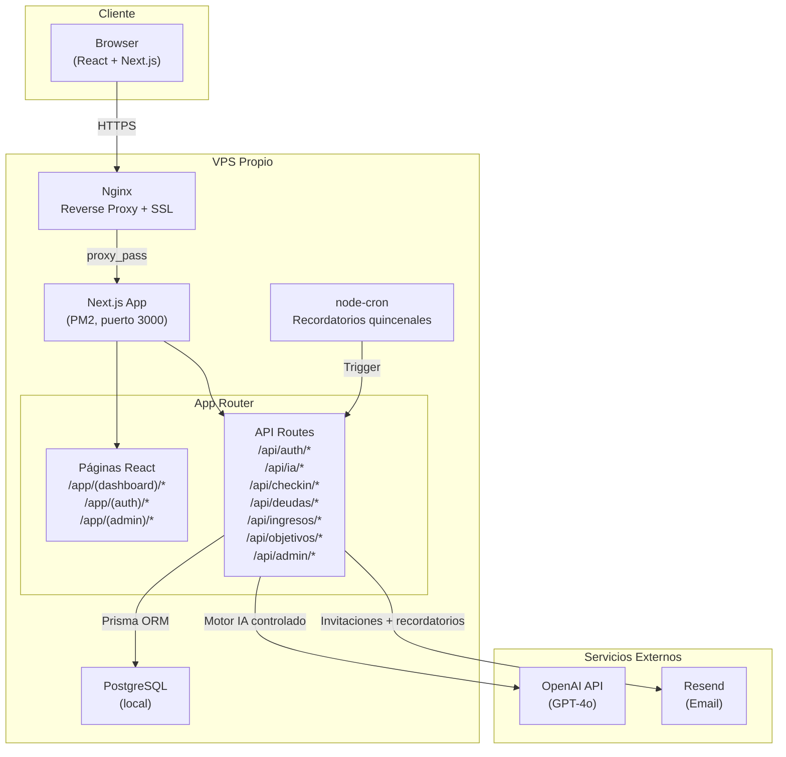
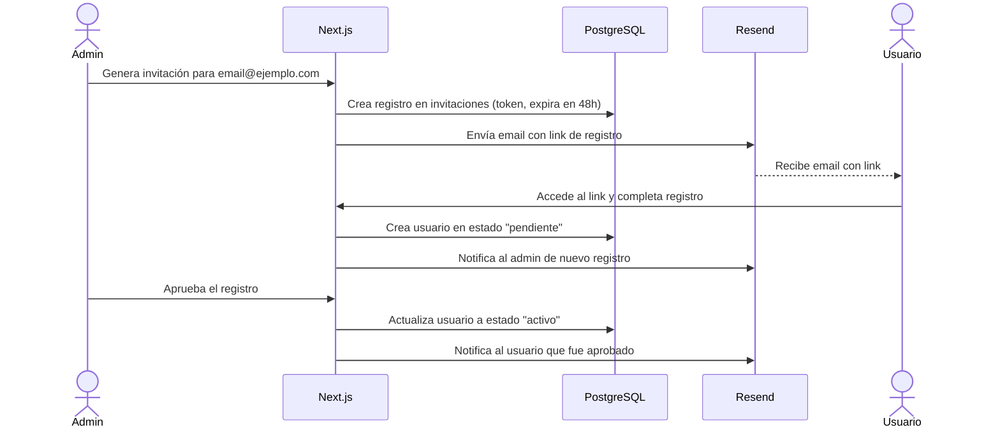
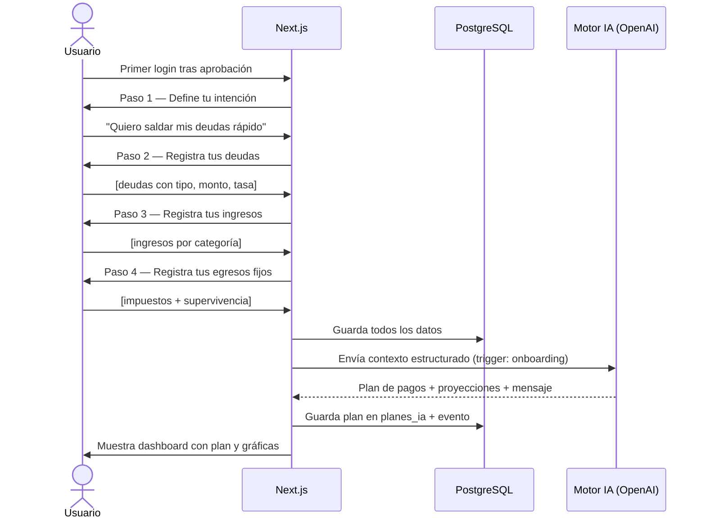
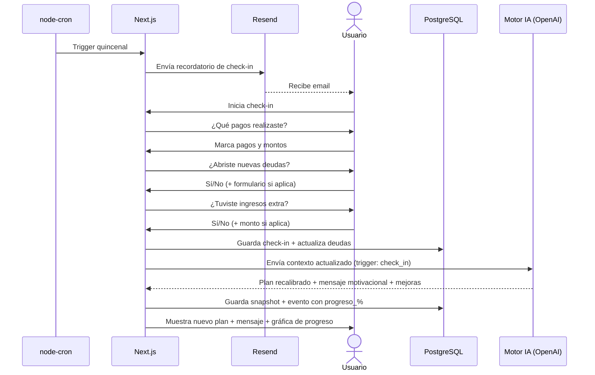
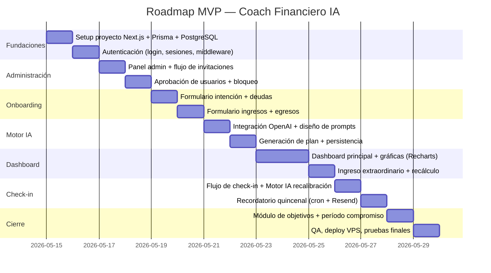

# Especificación Técnica de Requerimientos (ETR)
## Coach Financiero con IA — Aplicación Web Privada
**Versión:** 1.0 | **Fecha:** 2026-05-15 | **Analista:** Claude (Analista Funcional Senior)

---

## 1. Resumen Ejecutivo

Aplicación web privada de coaching financiero personal potenciada por IA. Permite a un grupo cerrado de hasta 11 usuarios registrar su situación financiera completa (ingresos, deudas, egresos fijos) y definir una intención u objetivo financiero. La IA genera un plan de acción personalizado, proyecciones y gráficas, y recalibra el plan en cada check-in quincenal manteniendo siempre la intención original como guía. La IA opera exclusivamente como motor backend en momentos controlados — no existe chat libre ni interacción conversacional expuesta al usuario.

---

## 2. Contexto y Objetivos de Negocio

### Problema que resuelve
Las personas conocen sus deudas e ingresos pero no saben cómo actuar de forma ordenada para lograr un objetivo financiero concreto. La falta de seguimiento sistemático hace que los planes fracasen en semanas.

### Propuesta de valor
Un coach financiero digital que:
- Traduce la situación financiera real en un plan ejecutable
- Recalibra el plan automáticamente con datos actualizados
- Mantiene la motivación con retroalimentación positiva y constante
- No requiere conocimientos financieros del usuario

### Métricas de éxito (KPIs)
- Usuario completa onboarding en < 10 minutos
- Tasa de check-in quincenal > 80% por usuario activo
- Reducción promedio de deuda demostrable en historial de eventos
- 0 incidentes de acceso no autorizado a datos financieros

### Alcance MVP
Aplicación web responsive con autenticación, formularios de ingreso de datos, generación de plan IA, dashboard con gráficas, check-in quincenal y panel de administración básico. Plazo: 15 días de desarrollo.

---

## 3. Glosario de Términos

| Término | Definición |
|---|---|
| **Intención** | Objetivo financiero principal que guía todos los análisis de la IA (ej. "Saldar deudas lo más rápido posible") |
| **Capacidad real** | `Ingresos totales − Egresos fijos (impuestos + supervivencia) = dinero disponible para objetivos` |
| **Check-in** | Revisión quincenal donde el usuario reporta avances y la IA recalibra el plan |
| **Período de compromiso** | 30 días mínimos antes de poder editar una intención activa |
| **Ingreso extraordinario** | Dinero no planificado recibido fuera de los ingresos habituales |
| **Plan IA** | Documento estructurado generado por la IA con pasos, prioridades y proyecciones |
| **Snapshot** | Registro inmutable del estado financiero en un momento dado, guardado en la tabla de eventos |
| **Motor IA** | Capa backend que llama a la API de OpenAI en momentos controlados, sin exposición al usuario |

---

## 4. Actores y Roles

### Usuario
- Gestiona sus propios datos financieros (privados e inaccesibles para otros)
- Define y administra sus intenciones/objetivos
- Realiza check-ins quincenales
- Visualiza su plan, proyecciones y progreso histórico

### Administrador
- Envía invitaciones por email con link de registro
- Aprueba o rechaza solicitudes de acceso
- Visualiza métricas de uso de la plataforma
- Bloquea o desbloquea usuarios
- **No tiene acceso a datos financieros de ningún usuario**

---

## 5. Requerimientos Funcionales

### Módulo de Acceso y Administración

| ID | Requerimiento | Prioridad |
|---|---|---|
| RF-001 | El administrador puede generar y enviar un link de invitación por email a una dirección específica | Must |
| RF-002 | El usuario accede al link de invitación y completa su registro (nombre, email, contraseña) | Must |
| RF-003 | El administrador recibe notificación de nuevo registro pendiente y puede aprobarlo o rechazarlo | Must |
| RF-004 | Solo los usuarios aprobados pueden iniciar sesión en la aplicación | Must |
| RF-005 | El administrador puede bloquear o desbloquear el acceso de cualquier usuario | Must |
| RF-006 | El panel de administración muestra: lista de usuarios, estado (activo/bloqueado/pendiente), último acceso | Must |
| RF-007 | Un usuario se considera "activo" cuando ha completado el onboarding (llenó todos los campos base) | Must |
| RF-064 | El panel muestra, por usuario, si terminó el onboarding y cuándo | Must |
| RF-065 | El administrador puede limpiar el onboarding de cualquier usuario: se borran su intención, sus deudas, sus ingresos y sus gastos fijos, y el usuario vuelve al flujo de onboarding en su siguiente acceso | Must |
| RF-066 | Limpiar el onboarding exige una confirmación explícita que nombra a la persona y enumera qué se borra y qué se conserva | Must |
| RF-067 | Limpiar el onboarding conserva la cuenta, la contraseña y el historial —check-ins, planes, eventos, ingresos extra y gastos grandes—, y no aplica a cuentas de administrador | Must |

**Nota sobre la numeración.** RF-064 a RF-067 continúan desde
`docs/ESPECIFICACION_GASTOS.md`, que llegó hasta RF-063. Van en este módulo
porque son del panel de administración, no del onboarding: quien los ejecuta es
el admin.

**Nota sobre RF-006.** El panel muestra desde el Sprint 10 una sexta columna con
el estado del onboarding (RF-064). Sigue sin mostrar un solo dato financiero
(RNF-006): una fecha de progreso no es una cifra.

**Nota sobre RF-013 y RF-034 — limpiar no dispara el Motor IA.** El plan se
genera cuando la persona vuelve a cerrar el onboarding, que es el disparador que
ya existe. Entre la limpieza y ese momento el usuario no tiene acceso al
dashboard, así que no hay nada que recalibrar.

### Módulo de Onboarding

| ID | Requerimiento | Prioridad |
|---|---|---|
| RF-008 | En el primer acceso, el sistema guía al usuario por un flujo de onboarding paso a paso | Must |
| RF-009 | Paso 1: El usuario define su intención financiera principal en texto libre | Must |
| RF-010 | Paso 2: El usuario registra sus deudas: tipo (T.C., crédito, hipoteca, terceros), monto total, tasa de interés (opcional) | Must |
| RF-011 | Paso 3: El usuario registra sus fuentes de ingreso: categoría (salario, arriendo, negocio, intereses, otro) y monto mensual | Must |
| RF-012 | Paso 4: El usuario registra sus egresos fijos: impuestos aproximados mensuales y gastos de supervivencia por categoría (mercado, recibos, colegiaturas, etc.) | Must |
| RF-013 | Al completar el onboarding, el sistema llama al Motor IA para generar el primer plan financiero | Must |

### Módulo de Dashboard

| ID | Requerimiento | Prioridad |
|---|---|---|
| RF-014 | El dashboard muestra: intención activa, dinero disponible para objetivos, total de deudas, proyección de tiempo para lograr la meta | Must |
| RF-015 | El dashboard muestra el plan de acción generado por la IA | Must |
| RF-016 | El dashboard muestra gráficas de proyección (deuda vs. tiempo, progreso acumulado) | Must |
| RF-017 | El dashboard muestra el historial de progreso por check-in (% de avance) | Must |
| RF-018 | El dashboard tiene un botón "Agregar ingreso extra" disponible en todo momento | Must |

### Módulo de Ingresos Extraordinarios

| ID | Requerimiento | Prioridad |
|---|---|---|
| RF-019 | El usuario puede registrar un ingreso extraordinario indicando: monto, descripción y fecha | Must |
| RF-020 | Al registrar un ingreso extraordinario, el Motor IA recalcula el plan incorporando el nuevo monto | Must |
| RF-021 | El ingreso extraordinario queda registrado en la tabla de eventos con su impacto en el plan | Must |

### Módulo de Objetivos

| ID | Requerimiento | Prioridad |
|---|---|---|
| RF-022 | El usuario puede tener hasta 3 intenciones activas simultáneamente | Must |
| RF-023 | La IA distribuye la capacidad real equitativamente entre las intenciones activas (sin pesos manuales en MVP) | Must |
| RF-024 | Cada intención tiene un período de compromiso de 30 días desde su creación o última edición | Must |
| RF-025 | El sistema muestra cuántos días faltan para poder editar cada intención | Must |
| RF-026 | La sección "Mis Objetivos" es independiente del flujo de check-in | Must |
| RF-027 | Cuando el usuario logra una meta, el sistema le propone definir una nueva intención | Must |

### Módulo de Check-in

| ID | Requerimiento | Prioridad |
|---|---|---|
| RF-028 | El sistema envía un email recordatorio al usuario cada 15 días para realizar el check-in | Must |
| RF-029 | El flujo de check-in pregunta: ¿qué pagos realizaste?, ¿abriste nuevas deudas?, ¿tuviste ingresos extra? | Must |
| RF-030 | Si el usuario abre nuevas deudas en el check-in, puede registrarlas con el mismo formulario de deudas | Must |
| RF-031 | Al completar el check-in, el Motor IA recalcula el plan y genera un mensaje motivacional con mejoras sugeridas, sin importar si el usuario va bien o mal | Must |
| RF-032 | El sistema guarda un snapshot del estado financiero y el porcentaje de progreso hacia cada objetivo | Must |
| RF-033 | Editar datos base fuera del check-in no cuenta como check-in ni altera la fecha del próximo | Must |

### Módulo de Motor IA

| ID | Requerimiento | Prioridad |
|---|---|---|
| RF-034 | El Motor IA se activa únicamente en 3 momentos: (1) fin de onboarding, (2) check-in completado, (3) ingreso extraordinario registrado | Must |
| RF-035 | No existe interfaz de chat ni input de texto libre para el usuario hacia la IA | Must |
| RF-036 | El Motor IA recibe siempre un contexto estructurado (JSON) con todos los datos financieros del usuario y su intención | Must |
| RF-037 | La intención original del usuario está siempre presente en el prompt del sistema enviado a la IA | Must |
| RF-038 | El proveedor de IA es configurable vía variable de entorno (por defecto: OpenAI GPT-4o) | Must |

### Módulo de Gastos (Sprint 9)

Detalle completo, con historias de usuario y criterios de aceptación, en
`docs/ESPECIFICACION_GASTOS.md`. Aquí solo el índice de requerimientos.

| ID | Requerimiento | Prioridad |
|---|---|---|
| RF-039 | La barra de navegación incluye un enlace "Gastos" hacia `/gastos` | Must |
| RF-040 | `/gastos` muestra dos secciones: gastos fijos (con total mensual) y gastos grandes | Must |
| RF-041 | Sin gastos fijos, la sección explica que sin ellos no se puede calcular la capacidad | Must |
| RF-042 | El usuario puede agregar un gasto fijo (categoría, monto, descripción opcional) | Must |
| RF-043 | El usuario puede editar cualquier gasto fijo propio | Must |
| RF-044 | El usuario puede eliminar un gasto fijo propio | Must |
| RF-045 | Toda alta, edición o baja de gasto fijo escribe un evento `egreso_actualizado` | Must |
| RF-046 | Al cambiar los gastos fijos, la capacidad real y las cifras se recalculan en la siguiente carga | Must |
| RF-047 | El usuario puede registrar un gasto grande puntual: monto, descripción y fecha (nunca futura) | Must |
| RF-048 | El sistema rechaza un gasto grande por debajo del 5% de los ingresos mensuales, explicando por qué | Must |
| RF-049 | El formulario de gasto grande no ofrece categorías y la pantalla no premia registrar más gastos | Must |
| RF-050 | Un gasto grande no modifica la lista de gastos fijos ni la capacidad real estructural | Must |
| RF-051 | El usuario puede eliminar un gasto grande propio; no se edita | Should |
| RF-052 | La sección lista los 12 gastos grandes más recientes, por fecha descendente | Must |
| RF-053 | Registrar un gasto grande sin haber completado el onboarding responde 409 | Must |
| RF-054 | "Disponible este mes" = capacidad real − gastos grandes del mes en curso, y su contexto lo dice | Must |
| RF-055 | La proyección de deuda y el "Faltan N meses" usan la capacidad **estructural**, nunca el disponible del mes | Must |
| RF-056 | "Disponible este mes" puede ser negativo y se muestra tal cual | Must |
| RF-057 | El dashboard sigue mostrando exactamente tres cifras | Must |
| RF-058 | `/gastos` muestra el total de gastos grandes del mes en curso | Should |
| RF-059 | Ni el CRUD de gastos fijos ni el gasto grande disparan el Motor IA | Must |
| RF-060 | Los gastos grandes de los últimos 30 días entran en el contexto del Motor IA | Must |
| RF-061 | El aviso de plan desactualizado se enciende también con un gasto grande posterior al plan | Must |
| RF-062 | El paso 4 del onboarding no cambia y sigue siendo obligatorio | Must |
| RF-063 | `PUT /api/egresos` (reemplazo total) queda reservado al onboarding | Must |

**Nota sobre RF-012.** Los gastos fijos que captura el paso 4 del onboarding ya
**no quedan congelados**: RF-042 a RF-044 permiten corregirlos y ampliarlos
después desde `/gastos`. El paso del onboarding no cambió.

**Nota sobre RF-014.** La cifra "dinero disponible para objetivos" del dashboard
descuenta desde el Sprint 9 los gastos grandes del mes en curso (RF-054). La
proyección de tiempo sigue calculándose sobre la capacidad estructural.

**Nota sobre RF-034 — sigue habiendo tres disparadores.** El gasto grande es el
gemelo del ingreso extraordinario y la simetría invita a convertirlo en un
cuarto, pero no lo es (RF-059). El plan se recalibra en el siguiente check-in y
mientras tanto el dashboard avisa (RF-061).

---

## 6. Historias de Usuario con Criterios de Aceptación

### HU-001 — Registro por invitación
**Como** persona invitada, **quiero** registrarme usando el link que recibí por email **para** poder acceder a la aplicación cuando el admin me apruebe.

**Criterios de aceptación:**
- **Given** que recibo un email con link de invitación válido
- **When** accedo al link y completo el formulario (nombre, email, contraseña)
- **Then** mi cuenta queda en estado "pendiente" y el admin recibe una notificación

---

### HU-002 — Onboarding completo
**Como** usuario aprobado, **quiero** ingresar mi situación financiera completa **para** que la IA genere mi primer plan personalizado.

**Criterios de aceptación:**
- **Given** que ingreso por primera vez tras ser aprobado
- **When** completo los 4 pasos (intención, deudas, ingresos, egresos)
- **Then** el sistema llama a la IA, genera el plan y me lleva al dashboard con el plan visible

---

### HU-003 — Check-in quincenal
**Como** usuario activo, **quiero** realizar mi check-in cada 15 días **para** que la IA ajuste mi plan con mis avances reales.

**Criterios de aceptación:**
- **Given** que recibo el email recordatorio a los 15 días
- **When** completo el flujo (pagos, nuevas deudas, extras)
- **Then** la IA genera un nuevo plan + mensaje motivacional y guarda el snapshot con % de progreso
- **And** el tono del mensaje es siempre positivo y propone al menos una mejora

---

### HU-004 — Ingreso extraordinario
**Como** usuario, **quiero** registrar dinero inesperado que recibí **para** ver cómo impacta mi plan financiero.

**Criterios de aceptación:**
- **Given** que estoy en el dashboard
- **When** presiono "Agregar ingreso extra" e ingreso monto, descripción y fecha
- **Then** la IA recalcula el plan incorporando ese dinero y actualiza las proyecciones

---

### HU-005 — Gestión de objetivos
**Como** usuario, **quiero** gestionar hasta 3 intenciones activas **para** que la IA trabaje en todos mis objetivos simultáneamente.

**Criterios de aceptación:**
- **Given** que tengo menos de 3 intenciones activas
- **When** agrego una nueva intención
- **Then** el sistema la registra con fecha de compromiso (+30 días) y la IA redistribuye la capacidad real
- **And** no puedo editar ninguna intención antes de que venza su período de compromiso

---

### HU-006 — Panel de administración
**Como** administrador, **quiero** controlar quién accede a la app **para** mantener el acceso exclusivo al grupo invitado.

**Criterios de aceptación:**
- **Given** que un usuario se registró con un link de invitación
- **When** reviso el panel de admin
- **Then** veo su solicitud pendiente y puedo aprobarla o rechazarla
- **And** puedo ver el último acceso de cada usuario activo
- **And** puedo bloquear a cualquier usuario en cualquier momento

---

## 7. Requerimientos No Funcionales

| ID | Categoría | Requerimiento |
|---|---|---|
| RNF-001 | **Seguridad** | Las contraseñas se almacenan con argon2id (ver nota) |
| RNF-002 | **Seguridad** | Las sesiones usan JWT con expiración de 24 horas + refresh token de 7 días |
| RNF-003 | **Seguridad** | Toda comunicación usa HTTPS (certificado SSL via Let's Encrypt en Nginx) |
| RNF-004 | **Seguridad** | La API Key de OpenAI y credenciales de DB nunca se exponen al cliente |
| RNF-005 | **Seguridad** | Cada endpoint de API valida que el usuario autenticado solo acceda a sus propios datos |
| RNF-006 | **Privacidad** | El administrador no tiene acceso técnico ni visual a los datos financieros de ningún usuario |
| RNF-007 | **Rendimiento** | El dashboard carga en < 3 segundos en conexión estándar |
| RNF-008 | **Rendimiento** | La respuesta de la IA se muestra con streaming o loader visible — máx. 30 segundos de espera |
| RNF-009 | **Disponibilidad** | Best effort — sin SLA formal para MVP |
| RNF-010 | **Usabilidad** | La app es responsive — funcional en móvil (375px+) y desktop (1280px+) |
| RNF-011 | **Usabilidad** | El onboarding se puede completar en < 10 minutos |
| RNF-012 | **Mantenibilidad** | Variables de entorno para todas las credenciales externas (OpenAI, Resend, DB) |
| RNF-013 | **Mantenibilidad** | El proveedor de IA es intercambiable vía variable de entorno sin cambios de código |
| RNF-014 | **Observabilidad** | Errores de llamadas a la IA quedan logueados en servidor con contexto suficiente para debug |
| RNF-015 | **Seguridad** | El `usuarioId` de los endpoints de gastos sale siempre de la sesión; un id ajeno responde 404, no 403 |
| RNF-016 | **Seguridad** | Sin cookie de sesión, los endpoints de gastos responden 401 |
| RNF-017 | **Privacidad** | Ningún dato de gastos aparece en el panel de administración |
| RNF-018 | **Rendimiento** | `/gastos` carga en < 3 s, con todas sus consultas en paralelo |
| RNF-019 | **Rendimiento** | El disponible del mes no añade una consulta por cifra: entra en el `Promise.all` existente |
| RNF-020 | **Usabilidad** | `/gastos` es funcional a 375px, sin scroll horizontal |
| RNF-021 | **Usabilidad** | Todo icono dentro de un `DialogTrigger asChild` nace en un componente cliente; se verifica cargando la página sin JavaScript |
| RNF-022 | **Mantenibilidad** | El umbral del gasto grande vive en una sola constante, leída por la validación y por la pantalla |
| RNF-023 | **Mantenibilidad** | La migración del Sprint 9 es puramente aditiva: ninguna columna se elimina ni se renombra |
| RNF-024 | **Consistencia** | Los gastos se guardan en la `monedaBase` del usuario, sin conversión |
| RNF-025 | **Observabilidad** | Los rechazos por umbral no se loguean con el monto |

**Nota sobre RNF-001 — argon2id en lugar de bcrypt.** La versión original de este
requerimiento pedía bcrypt con ≥ 12 rondas. Se implementó con **argon2id**
(`lib/auth/password.ts`), que es lo que hoy recomienda OWASP para contraseñas
nuevas: bcrypt trunca en 72 bytes y solo endurece contra CPU, mientras que
argon2id se parametriza además en memoria y paralelismo, que es lo que encarece
el crackeo con GPU. No es un cambio de alcance ni de coste —la librería
`argon2` ya estaba en el proyecto— y el requerimiento se da por cumplido con el
algoritmo más fuerte. Queda escrito aquí para que el checklist de QA no lo
marque como desviación pendiente.

**Nota sobre RNF-002 — dónde vive el refresh token.** El JWT de acceso (24 h)
viaja en la cookie `coach_session` y es **stateless**. El refresh (7 días) es un
token opaco en la cookie `coach_refresh`, guardado **hasheado** en la tabla
`sesiones`: rota en cada uso y su reutilización revoca la familia entera. Esa
mitad con estado es lo que permite un cierre de sesión real —un JWT no se puede
revocar— y lo que convierte el robo de una cookie en un incidente detectable.

---

## 8. Modelo de Datos

### Diagrama Entidad-Relación

```mermaid
erDiagram
    USUARIOS {
        uuid id PK
        string nombre
        string email
        string password_hash
        enum rol "usuario | admin"
        enum estado "pendiente | activo | bloqueado"
        timestamp ultimo_acceso
        timestamp created_at
    }

    OBJETIVOS {
        uuid id PK
        uuid usuario_id FK
        text intencion
        enum estado "activo | logrado | cancelado"
        timestamp editable_desde
        timestamp created_at
    }

    DEUDAS {
        uuid id PK
        uuid usuario_id FK
        enum tipo "tarjeta_credito | credito | hipoteca | terceros | otro"
        decimal monto_original
        decimal monto_actual
        decimal tasa_interes
        enum estado "activa | saldada"
        timestamp created_at
    }

    INGRESOS {
        uuid id PK
        uuid usuario_id FK
        enum categoria "salario | arriendo | negocio | intereses | otro"
        decimal monto_mensual
        timestamp created_at
    }

    EGRESOS {
        uuid id PK
        uuid usuario_id FK
        enum categoria "impuestos | mercado | recibos | colegiaturas | hijos | otro"
        decimal monto_mensual
        timestamp created_at
    }

    INGRESOS_EXTRA {
        uuid id PK
        uuid usuario_id FK
        decimal monto
        text descripcion
        date fecha
        timestamp created_at
    }

    CHECK_INS {
        uuid id PK
        uuid usuario_id FK
        jsonb pagos_realizados
        jsonb nuevas_deudas
        jsonb ingresos_extra
        text respuesta_ia
        jsonb plan_generado
        timestamp created_at
    }

    PLANES_IA {
        uuid id PK
        uuid usuario_id FK
        jsonb contenido
        enum trigger "onboarding | check_in | ingreso_extra"
        timestamp created_at
    }

    EVENTOS {
        uuid id PK
        uuid usuario_id FK
        enum tipo "check_in | deuda_pagada | deuda_nueva | ingreso_actualizado | egreso_actualizado | objetivo_creado | objetivo_logrado | ingreso_extra | plan_generado"
        jsonb payload
        decimal progreso_pct
        timestamp created_at
    }

    INVITACIONES {
        uuid id PK
        string email_destino
        string token
        enum estado "pendiente | usado | expirado"
        timestamp expires_at
        timestamp created_at
    }

    USUARIOS ||--o{ OBJETIVOS : "tiene"
    USUARIOS ||--o{ DEUDAS : "tiene"
    USUARIOS ||--o{ INGRESOS : "tiene"
    USUARIOS ||--o{ EGRESOS : "tiene"
    USUARIOS ||--o{ INGRESOS_EXTRA : "registra"
    USUARIOS ||--o{ CHECK_INS : "realiza"
    USUARIOS ||--o{ PLANES_IA : "recibe"
    USUARIOS ||--o{ EVENTOS : "genera"
```



---

## 9. Arquitectura Propuesta



---

## 10. Integraciones Externas

| Servicio | Propósito | Autenticación | Momentos de uso |
|---|---|---|---|
| **OpenAI API** | Generación y recalibración de planes financieros | API Key en variable de entorno | (1) Fin de onboarding, (2) Check-in completado, (3) Ingreso extraordinario |
| **Resend** | Envío de emails transaccionales | API Key en variable de entorno | (1) Invitación de admin, (2) Notificación de aprobación, (3) Recordatorio quincenal de check-in |

### Diseño del prompt del Motor IA

El Motor IA siempre envía un contexto estructurado. Nunca recibe texto libre del usuario:

```json
{
  "system": "Eres un coach financiero experto. Tu única función es analizar datos financieros y generar planes de acción. La intención del usuario es tu guía principal inamovible. Tu tono es siempre motivacional, constructivo y propones mejoras sin importar el resultado.",
  "intencion_usuario": "Quiero saldar mis deudas lo más rápido posible",
  "capacidad_real": 1500000,
  "deudas": [...],
  "objetivos_activos": [...],
  "historial_eventos": [...],
  "trigger": "check_in"
}
```

---

## 11. Flujos Principales

### Flujo 1 — Registro e Invitación



### Flujo 2 — Onboarding y Generación del Primer Plan



### Flujo 3 — Check-in Quincenal



---

## 12. Plan de Pruebas

### Pruebas Unitarias
- Cálculo de capacidad real (`ingresos - egresos`)
- Distribución equitativa de capacidad entre objetivos
- Validación de período de compromiso (30 días)
- Generación de tokens de invitación

### Pruebas de Integración
- Flujo completo de invitación → registro → aprobación
- Llamada al Motor IA y persistencia del plan resultante
- Envío de emails via Resend (modo sandbox)
- Trigger de cron y envío de recordatorios

### Pruebas End-to-End (E2E)
- Onboarding completo desde cero hasta dashboard
- Check-in con nuevas deudas e ingresos extra
- Bloqueo y desbloqueo de usuario desde admin

### Pruebas de Seguridad
- Un usuario no puede acceder a datos de otro usuario via API (IDOR)
- Endpoints de admin no accesibles con rol usuario
- Tokens de invitación expiran correctamente a las 48h

---

## 13. Riesgos Identificados y Mitigaciones

| Riesgo | Probabilidad | Impacto | Mitigación |
|---|---|---|---|
| Latencia alta de OpenAI (>30s) | Media | Alto | Mostrar loader con mensaje, timeout de 45s, loguear errores |
| Cambio de proveedor de IA | Baja | Medio | Abstracción via variable de entorno — solo cambiar key y modelo |
| Pérdida de datos en VPS | Baja | Alto | Backup diario de PostgreSQL (pg_dump + cron) |
| Token de invitación comprometido | Baja | Medio | Expiración de 48h + uso único (estado "usado" tras registro) |
| Check-in no realizado por usuario | Alta | Bajo | Recordatorio por email — la app funciona sin el check-in |
| Plan IA incoherente o mal formateado | Media | Medio | Validar estructura JSON del response antes de guardar; fallback a mensaje genérico |

---

## 14. Supuestos y Restricciones

### Supuestos
- El usuario ingresa datos verídicos y razonables (no hay validación de "realismo" financiero)
- La moneda es local del usuario — la app no hace conversiones de divisas
- El VPS tiene conectividad estable a internet para llamadas a OpenAI y Resend
- El usuario tiene acceso a su email para recibir invitaciones y recordatorios

### Restricciones
- Máximo 11 usuarios simultáneos (1 admin + 10 usuarios)
- Sin chat libre con la IA — el Motor IA opera solo en momentos controlados
- Acceso exclusivamente por invitación — sin registro público
- MVP en 15 días de desarrollo en solitario asistido por IA
- Sin obligaciones regulatorias formales (GDPR, HIPAA, etc.) en MVP

---

## 15. Roadmap — MVP 15 Días



---

## 16. Criterios de Aceptación del Proyecto

El MVP se considera completo cuando:

- [ ] Un admin puede invitar, aprobar y bloquear usuarios
- [ ] Un usuario nuevo completa el onboarding en < 10 minutos
- [ ] La IA genera un plan visible en el dashboard al finalizar el onboarding
- [ ] El usuario puede registrar un ingreso extraordinario y ver el plan actualizado
- [ ] El sistema envía recordatorio quincenal por email
- [ ] El check-in recalibra el plan con tono motivacional
- [ ] Las intenciones respetan el período de compromiso de 30 días
- [ ] Un usuario no puede ver ni modificar datos de otro usuario
- [ ] La app es usable en móvil (375px) y desktop (1280px)
- [ ] El proveedor de IA es intercambiable vía variable de entorno

---

## Anexo A — Estructura de Carpetas

```
debs-coach/
├── app/
│   ├── (auth)/
│   │   ├── login/
│   │   │   └── page.tsx
│   │   └── register/
│   │       └── page.tsx
│   ├── (dashboard)/
│   │   ├── dashboard/
│   │   │   └── page.tsx
│   │   ├── objetivos/
│   │   │   └── page.tsx
│   │   ├── deudas/
│   │   │   └── page.tsx
│   │   ├── ingresos/
│   │   │   └── page.tsx
│   │   └── checkin/
│   │       └── page.tsx
│   ├── (admin)/
│   │   └── admin/
│   │       └── page.tsx
│   ├── onboarding/
│   │   └── page.tsx
│   └── api/
│       ├── auth/
│       │   ├── login/route.ts
│       │   └── logout/route.ts
│       ├── admin/
│       │   ├── invitaciones/route.ts
│       │   └── usuarios/route.ts
│       ├── ia/
│       │   └── generar-plan/route.ts
│       ├── checkin/
│       │   └── route.ts
│       ├── deudas/
│       │   └── route.ts
│       ├── ingresos/
│       │   ├── route.ts
│       │   └── extra/route.ts
│       └── objetivos/
│           └── route.ts
├── components/
│   ├── ui/               ← shadcn/ui
│   ├── dashboard/
│   │   ├── ResumenFinanciero.tsx
│   │   ├── PlanIA.tsx
│   │   └── GraficaProgreso.tsx
│   ├── forms/
│   │   ├── FormDeudas.tsx
│   │   ├── FormIngresos.tsx
│   │   ├── FormEgresos.tsx
│   │   └── FormIngresoExtra.tsx
│   └── checkin/
│       └── FlujoChekin.tsx
├── lib/
│   ├── db/
│   │   └── prisma.ts
│   ├── ia/
│   │   ├── motor.ts        ← abstracción provider-agnóstica
│   │   └── prompts.ts      ← construcción de prompts estructurados
│   ├── email/
│   │   └── resend.ts
│   └── auth/
│       └── session.ts
├── prisma/
│   └── schema.prisma
├── emails/                 ← plantillas React Email
│   ├── Invitacion.tsx
│   ├── Aprobacion.tsx
│   └── RecordatorioCheckin.tsx
├── .env.local              ← nunca en git
├── .env.example
└── package.json
```

---

## Anexo B — Stack Tecnológico Recomendado

| Capa | Tecnología | Justificación |
|---|---|---|
| **Framework** | Next.js 14 (App Router) | Full-stack en un solo proyecto, SSR, API Routes, ideal para VPS con PM2 |
| **UI** | React 18 + TypeScript | Tipado fuerte reduce bugs en lógica financiera |
| **Estilos** | Tailwind CSS + shadcn/ui | Componentes accesibles y responsive sin diseño desde cero |
| **Gráficas** | Recharts | Librería React-native, fácil integración, responsive |
| **ORM** | Prisma | Type-safe, migraciones automáticas, excelente con PostgreSQL + TypeScript |
| **Base de datos** | PostgreSQL | ACID, ideal para datos financieros con transacciones |
| **Auth** | jose + cookies (JWT manual) | Control total sin dependencias de NextAuth para un caso tan específico |
| **IA** | OpenAI SDK | API Key ya disponible; abstracción permite cambiar a Anthropic/otro |
| **Email** | Resend + React Email | 3,000 emails/mes gratis, API simple, plantillas en JSX |
| **Cron** | node-cron | Recordatorios quincenales sin infraestructura adicional |
| **Deploy** | PM2 + Nginx + Let's Encrypt | Ya disponible en el VPS del usuario |
| **Validación** | Zod | Validación de schemas en API routes y formularios |

---

## Anexo C — Buenas Prácticas Aplicables

### Principios de diseño
- **KISS**: Sin abstracción prematura — una capa de servicio simple entre API routes y Prisma
- **YAGNI**: El MVP no incluye multi-moneda, exportación PDF, ni integraciones bancarias aunque podrían ser útiles
- **Single Responsibility**: El Motor IA (`lib/ia/motor.ts`) tiene una sola responsabilidad — nunca mezclar lógica de negocio con llamadas a la API

### Seguridad
- Variables de entorno para todas las credenciales — `.env.local` en `.gitignore`
- Middleware de autenticación en App Router que protege todas las rutas de dashboard y admin
- Row-level security lógica: cada query de Prisma siempre filtra por `usuario_id` del token de sesión

### Estrategia de branching
- **Trunk-Based Development** para desarrollo en solitario — una rama `main` + feature branches de vida corta
- Conventional Commits: `feat:`, `fix:`, `chore:`, `refactor:`

### Diseño de prompts IA
- Prompt del sistema inmutable — define rol, restricciones y tono
- Contexto del usuario siempre en formato JSON estructurado — nunca texto libre
- Separar la construcción del prompt (`prompts.ts`) de la llamada a la API (`motor.ts`) para facilitar pruebas

### Gestión de errores IA
- Si la llamada a OpenAI falla, mostrar mensaje genérico al usuario y loguear el error completo en servidor
- Nunca mostrar errores técnicos de la API al usuario final
